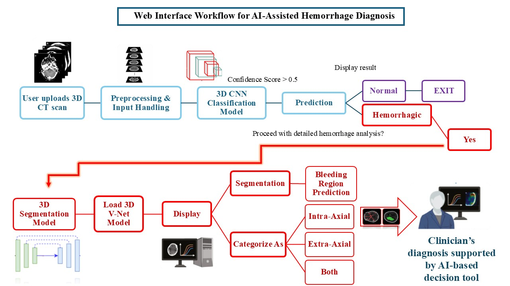

# HemoViz: AI-Assisted Intracranial Hemorrhage Diagnostic Tool
**MS Thesis Project**

---

## 📌 Project Overview
HemoViz is an end-to-end AI-guided pipeline designed for the automated management of **Spontaneous and Traumatic Intracranial Hemorrhage**. The system provides a clinical decision-support interface that classifies CT scans and performs detailed segmentations to assist in rapid neurosurgical intervention.

This repository showcases the **HemoViz Web Interface** and the **System Architecture**. To protect unpublished research findings and proprietary model logic, the core weights and raw datasets are kept private.

---

## 📊 System Workflow & Demonstration
The following diagram illustrates the HemoViz pipeline, from initial 3D CT upload to final clinical protocol generation.



### 📺 Video Demonstration
For a full walkthrough of the HemoViz application and its live interface, please view the demonstration via the link below:

🔗 **[Watch the HemoViz Project Demonstration (Google Drive)](PASTE_YOUR_GOOGLE_DRIVE_LINK_HERE)**

---

## 🛠 Technical Architecture
The HemoViz protocol follows a modular deep learning architecture:

1. **Preprocessing & Input Handling:** Automated DICOM to NIfTI conversion, intensity normalization, and volume reshaping.
2. **3D CNN Classification:** A binary classifier that screens for hemorrhagic vs. normal scans (Confidence threshold > 0.5).
3. **3D Segmentation (V-Net):** High-fidelity voxel-wise segmentation of bleeding regions to determine volume and anatomical location.
4. **Categorization Engine:** Automated classification of hemorrhages into **Intra-Axial**, **Extra-Axial**, or **Both** to guide standardized clinical protocols.

---

## 📂 Repository Structure
```text
HemoViz-AI-Assisted-Intracranial-Hemorrhage-Diagnostic-Tool/
├── assets/                  # CSS styling for interface and system assets
├── interface/               # UI/Web application code (unified_app.py)
├── utils/                   # DICOM processing and helper functions
├── .gitignore               # Configured to protect proprietary models and data
├── LICENSE                  # CC BY-NC-ND 4.0
├── Web_Interface_HemoViz_Overview.jpg # System workflow diagram
└── README.md                # Project documentation
